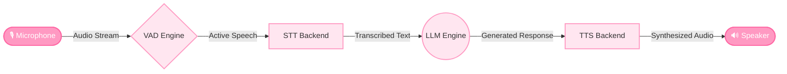
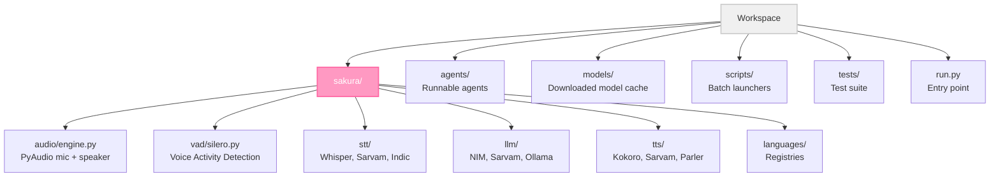
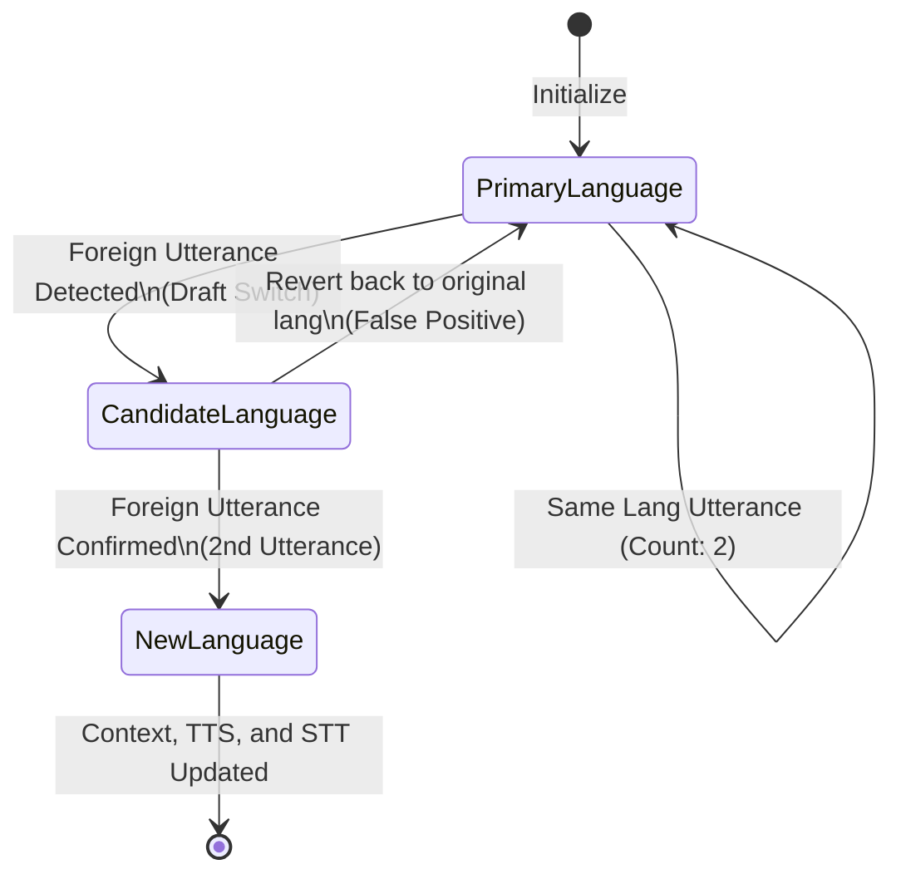

<div align="center">
  
  <h1>🌸 Sakura Voice Agent</h1>
  <p><strong>A powerful, standalone voice agent library for real-time, low-latency Indian-language voice conversations.</strong></p>
  <p><em>Meet Sakura — your multilingual AI voice companion, ready to speak 23 Indian languages!</em></p>
</div>

<br />

Sakura Voice Agent is a robust, modular framework designed to build intelligent, conversational voice assistants. Built from the ground up to excel at **Indian languages**, Sakura seamlessly blends Voice Activity Detection (VAD), Speech-to-Text (STT), Large Language Models (LLM), and Text-to-Speech (TTS) into a smooth, real-time pipeline.

Whether you rely on state-of-the-art APIs like Sarvam AI or need a **100% offline, privacy-first local experience**, Sakura has you covered with dynamic language auto-detection and ultra-fast inference.

---

## ✨ Key Features

- **🗣️ Multi-Agent Architecture**: Choose between `Local` (English-only), `Sarvam` (API), and `Indic` (100% offline) backends.
- **🇮🇳 Broad Indic Support**: Robust handling of up to 23 distinct Indian languages.
- **⚡ Real-Time Language Switching**: Mid-conversation auto-detection with a resilient 3-utterance smoothing window to prevent jarring language flip-flopping.
- **🔒 Privacy-First Offline Mode**: The Indic agent runs entirely on your local hardware—no internet required after the initial model download.
- **🧩 Highly Modular**: Swap STT, LLM, and TTS backends effortlessly according to your computing constraints.

---

## 🏗️ Architecture Matrix

Sakura's modular pipeline operates via a straightforward multi-step flow:



### Supported Backends

| Layer | Local Agent (Offline) | Sarvam Agent (Cloud API) | Indic Agent (100% Offline) |
|:-----:|:----------------------|:-------------------------|:---------------------------|
| **VAD** | Silero VAD (ONNX) | Silero VAD (ONNX) | Silero VAD (ONNX) |
| **STT** | Faster-Whisper | Saaras v3 (API) | IndicWhisper |
| **LLM** | NVIDIA NIM (API) | Sarvam-M (API) | Ollama / qwen2.5:7b |
| **TTS** | Kokoro (ONNX) | Bulbul v3 (API) | Indic Parler-TTS |
| **Langs** | English only | 23 Indian languages | 17 Indian languages |
| **Auth** | `NVIDIA_API_KEY` | `SARVAM_API_KEY` | None |

> **Note:** The **Indic agent** requires no API keys or internet access after the first launch. It downloads the required open-source models automatically and caches them locally!

---

## ⚙️ Project Structure

Clean separation of concerns for easy extending and debugging:



---

## 🚀 Getting Started

### 1. Basic Installation

Clone the directory and run the initialization script or use pip directly:

```bash
# Using batch launcher
scripts\setup.bat

# OR using standard package installation
pip install -r requirements.txt
```

Save a fresh environment file and populate it with your specific API credentials:
```bash
cp .env.example .env
```

### 2. Indic Offline Agent Setup (One-Time)

To harness the fully offline Indic agent, install the necessary native dependencies. The standard configuration leverages CPU-optimized Torch.

```bash
# 1. Install PyTorch (CPU-optimized)
pip install torch --index-url https://download.pytorch.org/whl/cpu

# 2. Install Parler-TTS from the HuggingFace repository
pip install git+https://github.com/huggingface/parler-tts.git

# 3. Setup Ollama & Pull the recommended model (https://ollama.ai/download)
ollama pull qwen2.5:7b        # ~4 GB (Best accuracy for Indic languages)
# or alternatively: ollama pull qwen2.5:3b  # ~2 GB (Lighter footprint)
```

> _**First Launch Behavior:** The first run of the Indic agent automatically downloads the IndicWhisper model (~950MB) and Parler-TTS Mini (~1.8GB). All subsequent launches are instantaneous and offline._

---

## 🎮 Running the Agents

Launch Sakura Voice Agent straight from your terminal.

```bash
# 1. Standard Local Agent (Fastest English processing)
python run.py

# 2. Sarvam Cloud Agent (Highly accurate 23 Language support)
python run.py --agent sarvam

# 3. Fully Offline Indic Agent (Private 17 Language support)
python run.py --agent indic
```

**Helpful Utility Commands:**
- List Sarvam-supported languages: `python run.py --list-languages`
- List offline Indic-supported languages: `python run.py --list-indic-languages`

---

## 🧠 Smart Language Context

Sakura implements dynamic language switching logic that maps context to user dialect smoothly. A voting window prevents stuttering when a user speaks a single foreign word as a loan-word.



**Example:**
```text
User [Hindi]:  "Namaste, aap kaise hain?" (STT: Hindi)
User [Hindi]:  "Mujhe ek kahani sunao."   (STT: Hindi)
  [Language Shift Detected: Hindi → Tamil]  ← 1st Tamil utterance detected but not confirmed yet
User [Tamil]:  "Unangalukku eppadi irukku?" ← 2nd Tamil utterance triggers full switch!
```

---

## 💻 Developer API & Usage as a Library

Easily embed Sakura's standalone components into your own Python applications.

```python
from sakura.stt import IndicWhisperSTT
from sakura.tts import IndicParlerTTS
from sakura.llm import OllamaLLM

# 1. Start fully standalone Indic Speech-To-Text
stt = IndicWhisperSTT(language="hi-IN")
text = stt.transcribe(my_audio_np)
print(f"Detected dialect: {stt.detected_language}") # E.g., ta-IN

# 2. Generate local Text-To-Speech
tts = IndicParlerTTS(target_language_code="hi-IN")
audio, sr = tts.generate("नमस्ते, मैं आपकी कैसे मदद कर सकता हूँ?")

# 3. Request LLM Inference via embedded Ollama pipeline
llm = OllamaLLM(model="qwen2.5:7b")
result = llm.chat_completion([{"role": "user", "content": "Hello!"}])
print(result)
```

---

## 🛠️ Configuration Explorer (`.env`)

Adapt Sakura through straightforward environment variables in your `.env` file:

```env
# -----------------------------
# Agent Connections
# -----------------------------
NVIDIA_API_KEY="your_nvidia_key"
SARVAM_API_KEY="your_sarvam_key"

# -----------------------------
# Sarvam Agent Preferences
# -----------------------------
SARVAM_LANGUAGE="hi-IN"      # 23 Indian language codes available
SARVAM_SPEAKER="Shubh"       # Select from 38 Bulbul v3 distinct voices

# -----------------------------
# Indic Offline Agent Preferences
# -----------------------------
INDIC_LANGUAGE="hi-IN"       # 17 Indian language codes available
OLLAMA_MODEL="qwen2.5:7b"    # Must match model downloaded via 'ollama pull'
OLLAMA_BASE_URL="http://localhost:11434/v1"

# -----------------------------
# Global Modifiers
# -----------------------------
SYSTEM_PROMPT="You are Sakura, an advanced AI voice assistant. Adhere strictly to user prompts."
```

---

<div align="center">
  <i>Developed with passion for cutting-edge conversational interfaces and the Indian AI ecosystem.</i>
</div>
